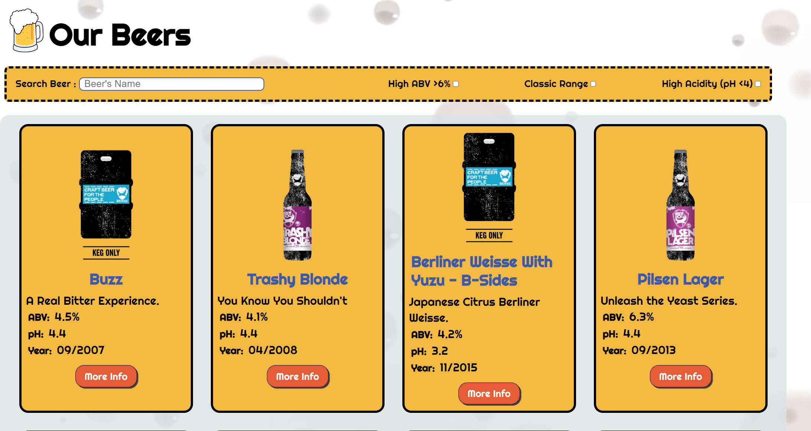
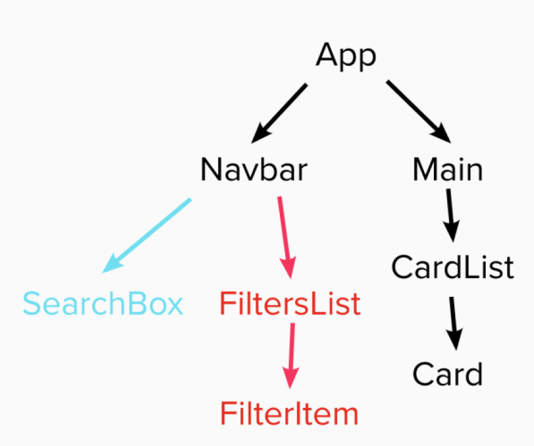

# Punk-API-Project

# Project Preview :

# Project Requirements :

1.  Built entirely in React
2.  Repository on GitHub
3.  Use the Punk API (after using the data file first) (
    https://punkapi.com/
    )
4.  Test where possible (RTL)

# Component Tree:

